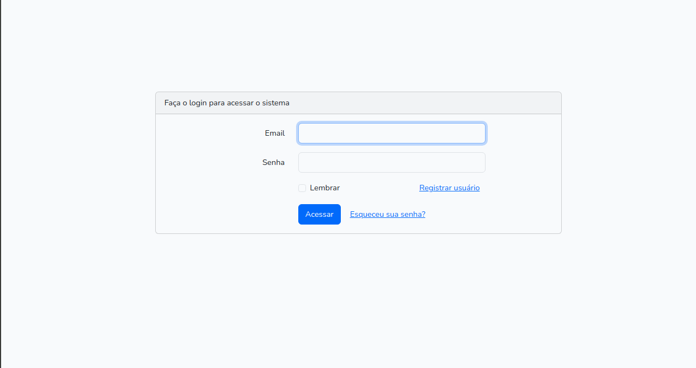
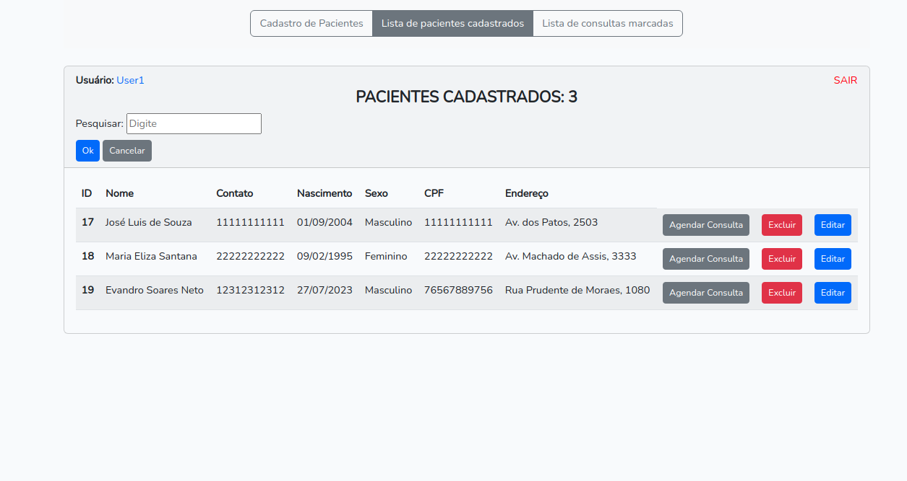
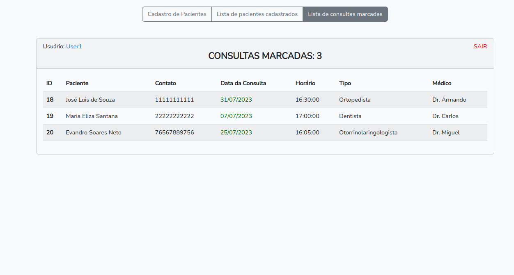
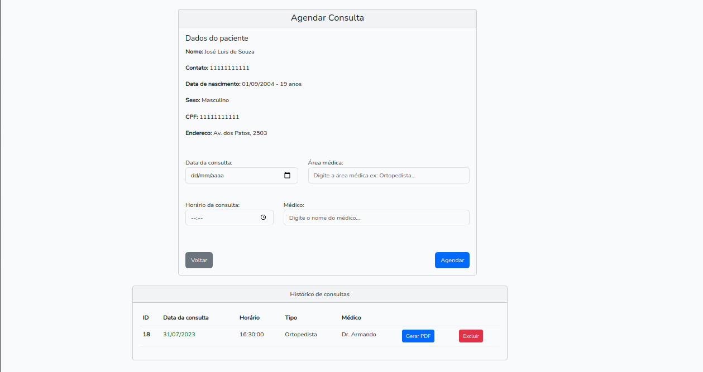

# Cadastro de Pacientes 📋
Este projeto tem como propósito o estudo e aperfeiçoamento no framework Laravel.
Tem como funcionalidades o cadastro de pacientes, cadastro de consultas para os pacientes, geração de PDF da consulta agendada e uma tela de login inicial.


## Capturas das telas principais 🖥️










## Instalação

Instale my-project com npm

```bash
  npm install my-project
  cd my-project
```
    
## Aprendizados

Os principais aprendizados que eu tive com este projeto foram: O relacionamento de 1 para N(onde 1 paciente pertence a N consultas) no Eloquent ORM, Implementação e uso do pacote Laravel UI com Bootstrap e Autenticação, uso do pacote DomPDF para exportação de pdf da consulta do paciente e também houve muita prática do CRUD em todos os formulários criados.